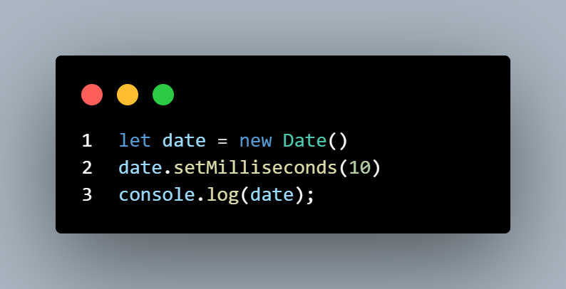
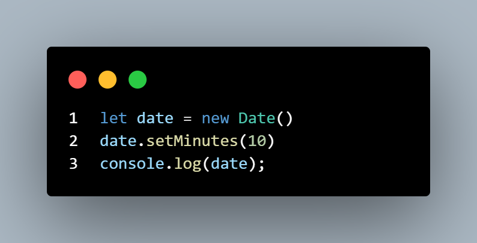
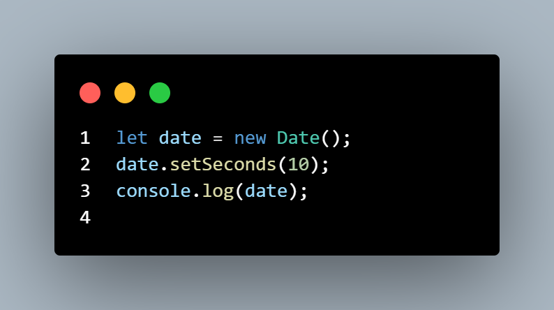
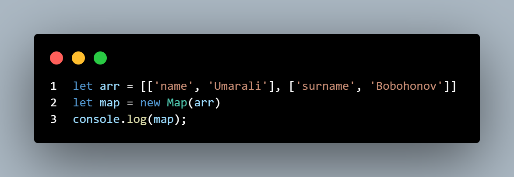
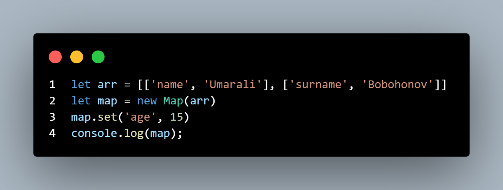
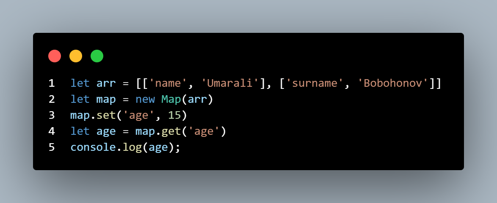
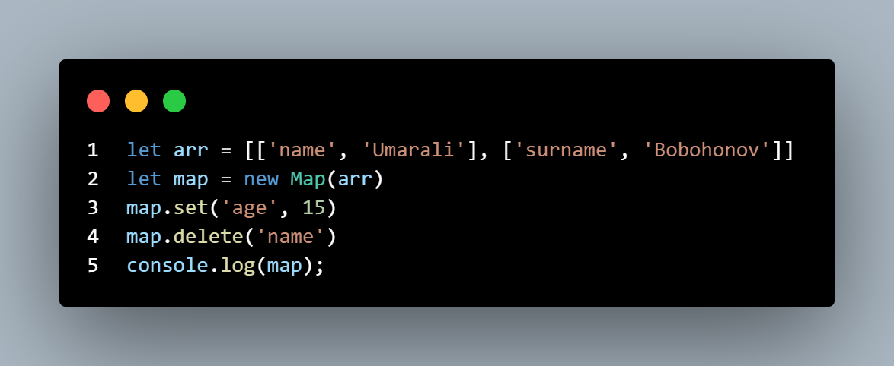
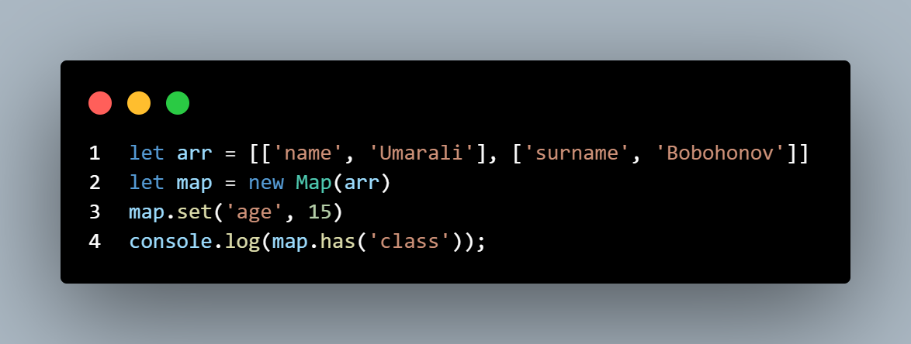

# Дар JavaScript мо конструтори new Date() дорем.
## ВАЛЕ new date() чист?
### Дар JavaScript, объектҳои сана бо new Date() сохта мешаванд. new Date() объекти санаро бо санаи дар компютерамон буда месозад ва онро бар мегардонад.
## new date аз 1 январи соли 1970 сар мешавад.
### вақте ки мо ин тавр new date - ро месозем (new Date())  - ба мо ба мо санаро бар мегардонад. Ва агар мо дар дарунаш параметр рои кнем у мисли милисекунд қабул мешавад, ва чиқадар милисекунд  рои кнем он қадар миллисекунд ба санаи 1 январи соли 1970 ҷамъ карда мешавад. Ва агар мо параметрҳоро бо string нависем 
```JS
let date = new Date('2024-11-14')
console.log(date);
```
### Онро бо чихели ҳаст қабул мекунад


## Ва инчунин new date() барои худ методҳо дорад


## 1.Методи getFullYear().
### Методи getFullYear() ба мо соле дар компютери мо бударо  ба мо бармегардонад.

## 2.Методи geMonth().
### getMonth() моҳоро ба мо бармегардонад. Ва он аз руи индекс меравад (яъне 0 то 11). январ =0, феврал = 1 ва дигарон.

## 2.Методи geDate().
### Методи getDate() рӯзи моҳро (1 то 31) санаро бармегардонад.


## 3.Методи getDay().
### Методи getDay() барои баргардонидани рӯзи ҳафта  аз объекти додашудаи Date истифода мешавад.Ва ин хам бо индекс бармегардонад(0 то 6). Синтаксис: DateObj.getDay() 


## 4.Методи getHours().
###  getHours() соати (0 то 23) санаро бармегардонад.


## 5.Методи getMinutes().
### getMinutes() дақиқаҳои (0 то 59) санаро бармегардонад.


## 6.Методи getSeconds().
### JavaScript Date getSeconds()getSeconds() сонияҳои (0 то 59) санаро бармегардонад.


## 7.Методи setDate().
### Ин мисли настройки аст, аммо мо танҳо ба ҷои get set менависем ва баъд методҳое, ки ҳамаашон ҳастанд. Қиматҳои додаҳо метавонанд ба монанди солҳо, моҳҳо, рӯзҳо, соатҳо, дақиқаҳо, сонияҳо ва миллисонияҳо барои Объекти санаро мо метавонем дигар кунем. 


## 8. Методи setMonth()
### Методи setMonth() барои иваз кардани мох мебошад. 

## 9. Методи setFullYears()
### Методи setFullYears() барои иваз кардани сол мебошад. Инчуни метавонад мох ва рузро иваз кунад.


## setHours() - барои бо соат кор кардан ва иваз  кардани он лозим аст.

## setMilliseconds()  - барои иваз кардани милисикунд мебошад.

## setMinutes() - барои иваз кардани минут мебошад

## setSecond() - барои аваз кардани сония мебошад.



# NEW MAP()

## new Map() - ин як колексия элементҳое мебошад ки аз ключ ва значенияҳо иборат аст.
## new Map() - ба мо барои он лозим аст ки мо массивҳоро ба мисли объект кунем.
 
## new Map() - ба худ методҳо дорад.
## методи set() - барои илова кардани элементи бо ключ ва значения лозим аст.

## get() - барои гирифтани ягон элемент лозим аст.

## delete - барои удалит кардани ягон элемент аз map лозим аст


## has - ин барои санҷидан ҳаст ки ягон элемент дар объект ҳаст ё не ва дар ҷавоб true false бар мегардонад.

